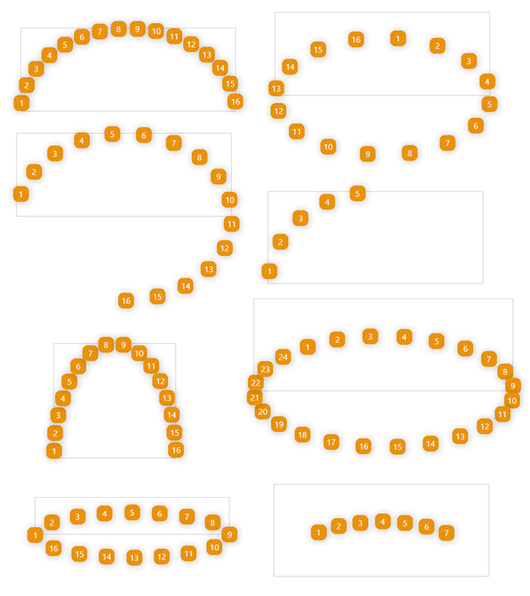

# Ellipsis HTML Elements

Mini tool to align HTML elements along an ellipse or a part of an ellipse. So you can arrange your HTML items along an
 ellipse easily without using canvas or any complex math functions.

**😎😎 [Online Demo](https://behnamazimi.github.io/ellipsis-html/)**

### Installation

Using npm:
```
npm install ellipsis-html
```

Using yarn:
```
yarn add ellipsis-html
```

Using unpkg CDN
```
<script src="http://unpkg.com/ellipsis-html/lib/ellipsis-html.min.js"></script>
```

### Usage
First, import `ellipsis-html` to your project. You can do it by adding the script tag that mentioned above, or you can
 import it as a module like this.
```javascript
import EllipsisHTML from "ellipsis-html";
``` 
 
After adding the library to your project, you can call it like this.
```javascript
const myEllipse = new EllipsisHTML(htmlElement, options)
``` 

There are two arguments that you should pass to the `EllipsisHTML`:
* **htmlElement:** the target element that you want to ellipse its child
* **options:** properties to shape your ellipse. You can see all in below table. 

#### Options

Property | Value | Default | Description
--- | --- | --- | ---
type | `equal`/`compact` | `equal` | Layout type of the ellipse. there are two types, equal and compact. The distance between items will be equal in "equal" mode. 
size | [0, 1] | 0.5 | Size of ellipse. Its a number between 0 and 1. if you want a entire ellipse it must be 1.
rotate | [0, 360] | 0 | Use this property to rotate ellipse. It could be a number between 0 and 360.  
reflection | [-1, +1] | 1 | Use this to mirroring the ellipse. its standard value is a number in range of [-1,+1] but you can set any numbers. for example, value 2 means two times height for the ellipse.   
shiftX | number | 0 | To shift whole layout to **right** or **left**. The value could be both positive and negative.
shiftY | number | 0 | To shift whole layout to **up** or **down**. The value could be both positive and negative.   

#### Render with new options
To update initial options you can use `.update(newOptions)` API. this method merges new options with the previous object 
and rerender the ellipse.   

### Example
```javascript
const elm = document.getElementById("demo");
const options = {
    type: "equal",  // compact, equal
    size: .5,       // 0, 1
    rotate: 5,      // 0, 360
    reflection: 1,  // 0, 1, only in compact layout
    reverse: false, 
    shiftX: 0,      // any number
    shiftY: 0,      // any number
}
const myEllipse = new EllipsisHTML(elm, options)

// to update options and rerender the ellipse
myEllipse.update({type: "compact", size: 1})
``` 

### Sample Layouts


### Contributing
I would be grateful to those who helped me make the project truly perfect. So, feel free to contribute to the project. 
Also, if you encounter any problem bring it up as an [issue](https://github.com/behnamazimi/ellipsis-html/issues/new).  

### License

[MIT](https://github.com/behnamazimi/ellipsis-html/blob/master/LICENSE)
