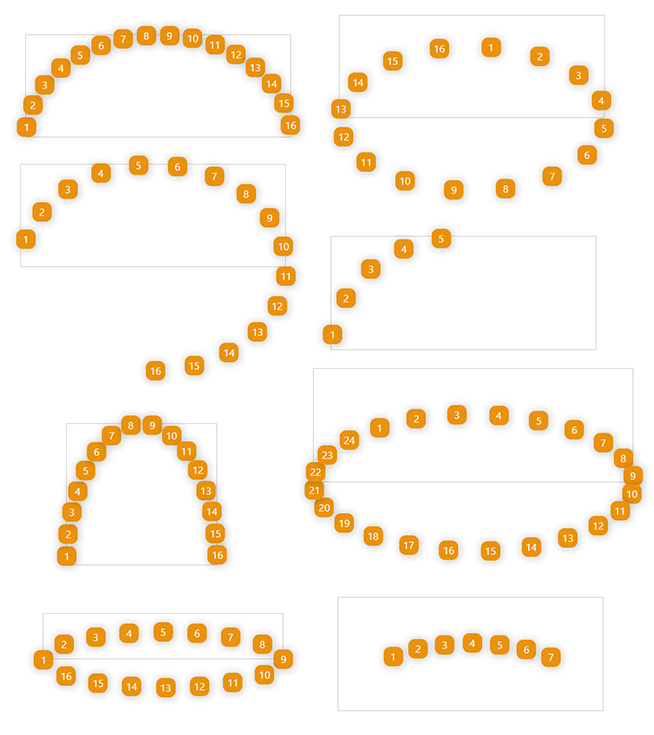

# Ellipse Elements

Mini tool to align HTML elements along an ellipse or a part of an ellipse. 

**[Online Demo](https://behnamazimi.github.io/ellipse-elements/)**

### Installation

Using npm:
```
npm install ellipse-elements
```

Using yarn:
```
npm install ellipse-elements
```

Using unpkg CDN
```
<script src="http://unpkg.com/ellipse-elements/lib/ellipse-elements.min.js"></script>
```

### Usage
After importing `ellipse-elements` to your project, you can call it like this,
```javascript
const myEllipse = new EllipseElements(htmlElement, options)
``` 

There are two arguments that you should pass to the `EllipseElements`:
* **htmlElement:** the target element that you want to ellipse its child
* **options:** properties to shape your ellipse. You can see all in below table. 

Property | Default | Description
--- | --- | ----
type | equal | layout type of the ellipse. there are two types, equal and compact. The distance between items in "equal" mode is equal. 
size | 0.5 | size of ellipse. its a number between 0 and 1. if you want a entire ellipse it must be 1
rotate | 0 | use this property to rotate ellipse. its a number between 0 and 360.  
reflection | 1 | use this to mirroring the ellipse. its standard value is a number in range of [-1,+1] but you can set any numbers. for example, value 2 means two times height of the ellipse.   

#### Render with new options
To update initial options you can use `.update(newOptions)` api. this method merges new options with the previous object 
and rerender the ellipse.   

### Example
```javascript
const elm = document.getElementById("demo");
const options = {
    type: "equal", // compact, equal
    size: .5, // 0, 1
    rotate: 5, // 0, 360
    reflection: 1, // 0, 1, only in compact layout
    reverse: false
}
const htmlEllipse = new EllipseElements(elm, options)

// to update options and rerender the ellipse
htmlEllipse.update({size: 1})
``` 

### Sample Layouts


